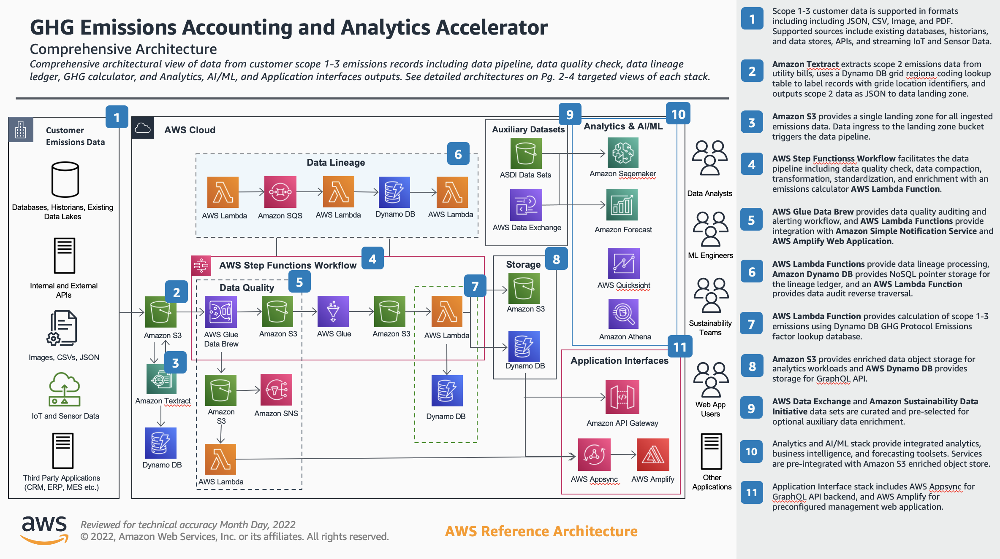
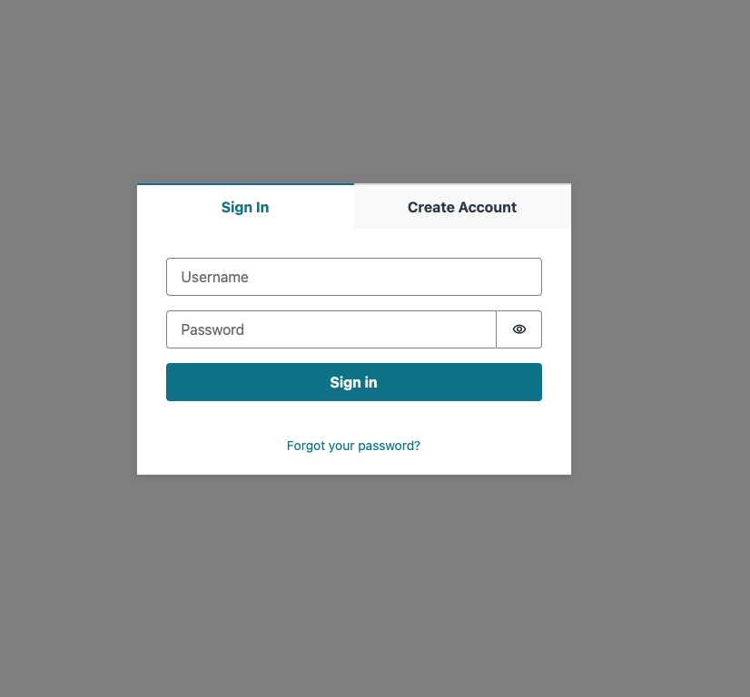
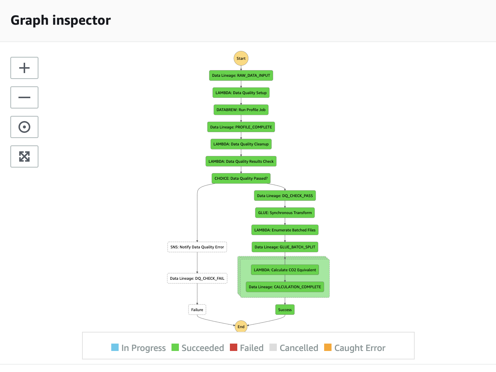

# Welcome to CarbonLake Quickstart CDK Application

CarbonLake Quickstart (CLQS) is a decarbonization data accelerator solution built on existing AWS Services. CarbonLake Quickstart reduces the undifferentiated heavy lifting of ingesting, standardizing, transforming, and calculating carbon and ghg emission data so that customers can build decarbonization reporting, forecasting, and analytics solutions and products for internal and external use. CarbonLake includes a purpose-built data pipeline, data quality module, data lineage module, emissions calculator microservice, business intelligency services, prebuilt forecasting machine learning notebook and compute service, GraphQL API, and sample web application. CarbonLake data is ingested through the CarbonLake landing zone, and can be ingested from any service within or connected to the AWS cloud.

## 🛠 What you will build



1. Scope 1-3 customer data is supported in formats including including JSON, CSV, Image, and PDF. Supported sources include existing databases, historians, and data stores, APIs, and streaming IoT and Sensor Data.
2. Amazon S3 provides a single landing zone for all ingested emissions data. Data ingress to the landing zone bucket triggers the data pipeline.
3. AWS Step Functions Workflow orchestrates the data pipeline including data quality check, data compaction, transformation, standardization, and enrichment with an emissions calculator AWS Lambda Function.
4. AWS Glue Data Brew provides data quality auditing and alerting workflow, and AWS Lambda Functions provide integration with Amazon Simple Notification Service and AWS Amplify Web Application.
5. AWS Lambda Functions provide data lineage processing, queued by Amazon SQS. Amazon Dynamo DB provides NoSQL pointer storage for the data ledger, and an AWS Lambda Function provides data audit reverse traversal.
6. AWS Lambda Function provides calculation of scope 1-3 emissions using a pre-seeded Amazon DynamoDB GHG Protocol Emissions factor lookup database.
7. Amazon S3 provides enriched data object storage for analytics workloads and AWS Dynamo DB provides storage for GraphQL API.
Analytics and AI/ML stack provide integrated analytics, business intelligence, and forecasting toolsets including a prebuilt Amazon Sagemaker notebook, AWS Quicksight with prebuilt BI dashboards and visualizations, and Amazon Athena for querying data stored in 8. Amazon S3. Services are pre-integrated with Amazon S3 enriched object store.
9. AWS Appsync provides a GraphQL API backend for integration with web applications and other data consumer applications, and AWS Amplify provides a serverless pre-configured management application that includes basic data browsing, data visualization, data uploader, and application configuration.

## Application Stacks

### Shared Resource Stack

The shared resource stack deploys all cross-stack referenced resources such as S3 buckets and lambda functions that are built as dependencies.

Review the [Shared Resources Stack](lib/stacks/stack-shared-resources/carbonlake-qs-shared-resources-stack.ts) and [Stack Outputs](#shared-resources-stack-outputs)

### Optional CI/CD Pipeline

The optional CI/CD pipeline using AWS Codecommit, AWS Codebuild, AWS Codepipeline, and AWS Codedeploy to manage a self-mutating CDK pipeline. This pipeline can pick up commits to a defined branch of a github, gitlab, or codecommit repository and push them through an AWS DevOps services workflow.

Review the [Optional CI/CD Stack](lib/stacks/stack-ci-cd/carbonlake-qs-ci-cd-pipeline-stack.ts)

### Data Pipeline

The CarbonLake data pipeline is an event-driven Step Functions Workflow triggered by each upload to the CarbonLake landing zone S3 bucket. The data pipeline performs the following functions:

1. AWS Glue Data Brew Data Quality Check: If the data quality check passes the data is passed to the next step. If the data quality check fails the admin user receives a Simple Notification Services alert via email.
2. Data Transformation Glue Workflow: Batch records are transformed and prepared for the CarbonLake calculator microservice.
3. Data Compaction: night data compaction jobs prepare data for analytics and machine learning workloads.
4. Emissions Calculator Lambda Microservice: An AWS Lambda function performed emissions factor database lookup and calculation, outputting records to a Amazon DynamoDB table and to an S3 bucket for analytics and AI/ML application.
5. Data Transformation Ledger: Each transformation of data is recorded to a ledger using Amazon Simple Queue Service, AWS Lambda, and Amazon DynamoDB.

Review the [Data Pipeline Stack](lib/stacks/stack-data-pipeline/carbonlake-qs-pipeline-stack.ts), [README](lib/stacks/stack-data-pipeline/README.md), and [Stack Outputs](#data-pipeline-stack-outputs)

### Emissions Factor Reference Databases preseeded in a Amazon DynamoDB table

The Carbon Emissions Calculator Microservice comes with a pre-seeded Amazon DynamoDB reference table. This data model directly references the World Resource Institute GHG Protocol model.

### AWS AppSync GraphQL API

A pre-built AWS AppSync GraphQL API provides flexible querying for application integration. This GraphQL API is authorized using Amazon Cognito User Pools and comes with a predefined Admin and Basic User role. This GraphQL API is used for integration with the CarbonLake AWS Amplify Sample Web Application.

Review the [Shared Resources Stack](lib/stacks/stack-shared-resources/carbonlake-qs-shared-resources-stack.ts) and [Documentation](lib/stacks/stack-api/README.md) and [Stack Outputs](#api-stack-outputs)

### Optional: AWS Amplify Sample Web Application

An AWS Amplify application can be deployed optionally and hosted via Amazon Cloudfront. The AWS Amplify application references the outputs of a full successful CarbonLake Quickstart deployment and requires additional manual deployment steps outlines in the associated module README file.

Review the [Sample Web Application Stack](front-end/carbonlake-ui-cloudscape/) and [Documentation](front-end/carbonlake-ui-cloudscape/documentation/README.md)

### Optional: Amazon Quicksight Module with prebuilt visualizations and Analysis

An Amazon Quicksight stack can be deployed optionally with pre-built visualizations for Scope 1, 2, and 3 emissions. This stack requires additional manual setup in the AWS console detailed in this guide.

### Optional: Sagemaker Notebook Instance with pre-built Machine Learning notebook

A pre-built machine learning notebook is deployed on an Amazon Sagemaker Notebook EC2 instance with `.ipynb` and pre-built prompts and functions.

### Sample Data Collection for Testing

The CarbonLake Quickstart application comes with sample data for testing successful deployment of the application and can be found in teh `resource/sample-data` directory.

## What it does

This Quickstart provides core functionality to accelerate data ingestion, processing, calculation, storage, analytics and insights. The following list outlines the current capabilities and limitations of the CarbonLake Quickstart. Please submit a PR to request additional capabilities and features. We appreciate your feedback as we continue to improve this offering.

### Capabilities

The following list of capabilities covers current capabilities as recorded and updated August 2022:

1. Accepts CSV formatted data inputs as S3 upload to CarbonLake Landing Bucket
2. Accepts mult-part and standard upload via S3 CLI, Console, and other programmatic means
3. Accepts single file upload via AWS Amplify console with optional web application
4. Provides daily data compaction at midnight in local time
5. Performs calculation using pre-built GHG calculator lookup table
6. Can accept new calculator lookup table and data model with required updates to JSON files for data quality AND calculator.

### Limitations

The following list of limitations covers current known functional limitations as recorded and updated August 2022:

1. Does not accept file type JSON, Parquet, XML, and all image file types.
2. Does not accept multi-file upload via sample web application
3. Does not allow for data model update from a single data model file source (currently requires manual editing of multiple files).

## 💲 Cost and Licenses

You are responsible for the cost of the AWS services used while running this Quick Start reference deployment. There is no additional cost for using this Quick Start.

The AWS CloudFormation templates for this Quick Start include configuration parameters that you can customize. Some of these settings, such as instance type, affect the cost of deployment. For cost estimates, see the pricing pages for each AWS service you use. Prices are subject to change.

Tip: After you deploy the Quick Start,  create AWS Cost and Usage Reports to track costs associated with the Quick Start. These reports deliver billing metrics to an S3 bucket in your account. They provide cost estimates based on usage throughout each month and aggregate the data at the end of the month. For more information, see  What are AWS Cost and Usage Reports?

This Quickstart doesn’t require any software license or AWS Marketplace subscription.

## How to Deploy

You can deploy CarbonLake Quickstart through the manual setup process using AWS CDK. We recommend use of an AWS Cloud9 instance in your AWS account or VS Code and the AWS CLI. We also generally recommend a fresh AWS account that can be integrating with your existing infrastructure using AWS Organizations.

## 🎒 Pre-requisites

- The [aws-cli](https://docs.aws.amazon.com/cli/latest/userguide/cli-chap-install.html) must be installed *and* configured with an AWS account on the deployment machine (see <https://docs.aws.amazon.com/cli/latest/userguide/cli-chap-install.html> for instructions on how to do this on your preferred development platform).
- This project requires [Node.js](http://nodejs.org/). To make sure you have it available on your machine, try running the following command.

  ```sh
  node -v
  ```

- For best experience we recommend installing CDK globally: `npm install -g aws-cdk`

## 🚀 Setup

### 0/ Use git to clone this repository to your local environment

```sh
git clone #insert-http-or-ssh-for-this-repository
```

### 1/ Set up your AWS environment

- Configure your AWS credentials --> `aws configure`
- Get your AWS Account Number --> `aws sts get-caller-identity`
- Bootstrap CDK so that you can build cdk assets --> `cdk bootstrap aws://ACCOUNT-NUMBER/REGION` or `cdk bootstrap` if you are authenticated through aws configure

### 2/ Prepare your CDK environment (Manual Setup)

1. Navigate to CDK Directory
2. Set `cdk.context.json` values --> The `cdk.context.json` file tells the CDK Toolkit the context and parameters for your app.

#### **Context Parameters**

Before deployment navigate to `cdk.context.json` and update the required context parameters which include: `adminEmail`, and `repoBranch`. Review the optional and required context variables below.

- Required:`adminEmail` The email address for the administrator of the app
- Required:`repoBranch` The branch to deploy in your pipeline (default is `/main`)
- Optional:`quicksightUserName` Username for access to the carbon emissions dataset and dashboard.
- Optional:`deployQuicksightStack` Determines whether this stack is deployed. Default is false, change to `true` if you want to deploy this stack.
- Optional:`deploySagemakerStack` Determines whether this stack is deployed. Default is false, change to `true` if you want to deploy this stack.
Note: If you choose to deploy the optional Quicksight Module make sure you review [QuickSight setup instructions](lib/stacks/stack-quicksight/documentation/README.md)

### 3/ Install dependencies, build, and synthesize the CDK app

- Install dependencies

```sh
npm ci
```

- Build your node application and environment

```sh
npm run build
```

- Synthesize the CDK application

```sh
cdk synth
```

### 4/ Deploy the application

- ✅  Recommended: deploy for local development

```sh
cdk deploy --all
```

👆 If you are deploying only for local development this will deploy all of the CarbonLake stacks without the CI/CD pipeline. This is recommended.

- ⛔️  Advanced User: deploy through CI/CD pipeline with linked repository

```sh
npm run deploy:cicd
```

👆 If you are deploying the full CI/CD pipeline will deploy the pipeline and you will have to connect your repo for automated deployment. Use the [README for the gitlab mirroring component](lib/constructs/construct-gitlab-mirroring/README.md) to get set up. Please note that this will require some knowledge of DevOps services in AWS and is considered an advanced implementation.

### 4/ Optional: Set up the Amplify Web Application

As a prerequisite you will need to install `jq` with `brew install jq` `apt-get install jq` `yum install -y jq` or another suitable method for package installation. For more on installing `jq` for your operating system visit the [jq docs](https://stedolan.github.io/jq/download/).

For quick setup follow the instructions below. For advanced manual setup instructions review [Web Application README](front-end/carbonlake-ui-cloudscape/documentation/README.md)

#### Recommended: Quick Setup

```sh
cd <top-level-director-of-this-project>
npm run web # make sure you wait and follow the prompts
# after this runs go click on the link to your page
```

When you open the web application in your browser you should see a cognito login page with input fields for an email address and password. Enter your email address and the temporary password sent to your email when you created your CarbonLake Quickstart CDK Application. After changing your password, you should be able to sign-in successfully at this point.

***NOTE: The sign-up functionality is disabled intentionally to help secure your application. You may change this and add the UI elements back, or manually add the necessary users in the cognito console while following the principle of least privilege (recommended).***




Success! At this point, you should successfully have the Amplify app working.

#### Advanced: Manual Setup

If you wish to complete a manual deployment process or modify your existing deployment please follow the [Web Application README](front-end/carbonlake-ui-cloudscape/documentation/README.md) to manually deploy the AWS Amplify sample web application. The AWS Amplify CLI will use outputs from your application deployment, so you have to deploy CarbonLake first.

### Optional A/ Manually enable & set up Amazon Quicksight Stack

If you choose to deploy the Amazon Quicksight business intelligence stack it will include prebuilt data visualizations that leverage Amazon Athena to query your processed data. If you elect to deploy this stack you will need to remove the comments.

Before you proceed you need to set up your quicksight account and user. This needs to be done manually in the console, so please open this link and follow the instructions [here](lib/stacks/stack-quicksight/documentation/README.md).

To deploy this stack navigate to `cdk.context.json` and change `deployQuicksightStack` value to `true` and redeploy the application by running `cdk deploy --all`

### Optional B/ Manually enable & set up Forecast stack

The forecast stack includes a pre-built sagemaker notebook instance running an `.ipynb` with embedded machine learning tools and prompts.

To deploy this stack navigate to `cdk.context.json` and change `deploySagemakerStack` value to `true` and redeploy the application by running `cdk deploy --all`

## 🗑 How to Destroy

You can destroy all stacks included in CarbonLake Quickstart with `cdk destroy --all`. You can destroy individual stacks with `cdk destroy --StackName`. By default using CDK Destroy will destroy EVERYTHING. Use this with caution! We strongly recommend that you modify this functionality by applying no delete defaults within your CDK constructs. Some stacks and constructs that we recommend revising include:

- DynamoDB Tables
- S3 Buckets
- Cognito User Pools

## Work with outputs

The CDK stacks by default export all stack outputs to `cdk-outputs.json` at the top level of the directory. You can disable this feature by removing `"outputsFile": "cdk-outputs.json"` from `cdk.json` but we recommend leaving this feature, as it is a requirement for some other features. By default this file is ignored via .gitignore so any outputs will not be commited to a version control repository. Below is a guide to the standard outputs.

### Shared Resources Stack Outputs

Shared resource stack outputs include:

- `CLQSAwsRegion`: Region of CDK Application AWS Deployment.
- `CLQSEnrichedDataBucket`: Enriched data bucket with outputs from calculator service.
- `CLQSEnrichedDataBucketUrl`: Url for enriched data bucket with outputs from calculator service
- `CLQSDataLineageBucket`: Data lineage S3 bucket
- `CLQSDataLineageBucketUrl`: Data lineage S3 bucket URL

### API Stack Outputs

-`CLQSuserPoolId`: Cognito user pool ID for authentication
-`CLQidentityPoolId`: Cognito Identity pool ID for authentication
-`CLQSuserPoolClientId`: Cognito user pool client ID for authentication
-`CLQSclqsAdminUserRoleOutput`: Admin user role output
-`CLQSclqsStandardUserRoleOutput`: Standard user role output
-`CLQSApiEndpoint`: GraphQL API endpoint
-`CLQSApiUsername`: GraphQL API admin username
-`CLQSGraphQLTestQueryURL`: GraphQL Test Query URL (takes you to AWS console if you are signed in).

### Data Pipeline Stack Outputs

-`LandingBucketName`: S3 Landing Zone bucket name for data ingestion to CarbonLake Quickstart Data Pipeline.
-`CLQSLandingBucketUrl`: S3 Landing Zone bucket URL for data ingestion to CarbonLake Quickstart Data Pipeline.
-`CLQSGlueDataBrewURL`: URL for Glue Data Brew in AWS Console.
-`CLQSDataPipelineStateMachineUrl`: URL to open CLQS State machine to view step functions workflow status.

### Quicksight Stack Outputs

-`QuickSightDataSource`: ID of QuickSight Data Source Connector Athena Emissions dataset. Use this connector to create additional QuickSight datasets based on Athena dataset.
-`QuickSightDataSet`: ID of pre-created QuickSight DataSet, based on Athena Emissions dataset. Use this pre-created dataset to create new dynamic analyses and dashboards.
-`QuickSightDashboard`: ID of pre-created QuickSight Dashboard, based on Athena Emissions dataset. Embed this pre-created dashboard directly into your user facing applications.
-`CLQSQuicksightUrl`: URL of Quicksight Dashboard.

### Sagemaker Notebook Stack Outputs

-`CLQSSagemakerRepository`: Codecommit repository of sagemaker notebook.
-`CLQSSagemakerNotebookUrl`: AWS console URL for Sagemaker Notebook ML Instance.

### Test Stack Outputs

-`CLQSe2eTestLambdaFunctionName`: Name of CarbonLake lambda test function.
-`CLQSe2eTestLambdaConsoleLink`: URL to open and invoke calculator test function in the AWS Console.

## 🛠 Usage

Time to get started using CarbonLake Quickstart! Follow the steps below to see if everything is working and get familiar with this solution.

### 1/ Make sure all the infrastructure deployed properly

In your command line shell you should see confirmation of all resources deploying. Did they deploy successfully? Any errors or issues? If all is successful you should see indication that CDK deployed. You can also verify this by navigating to the Cloudformation service in the AWS console. Visually check the series of stacks that all begin with `CLQS` to see that they deployed successfully. You can also search for the tag:

```json

"application": "carbonlake"

```

### 2/ Drop some synthetic test data into the CarbonLake landing zone S3 Bucket

Time to test some data out and see if everything is working. This section assumes basic prerequisite knowledge of how to manually upload an object to S3 with the AWS console. For more on this please review [how to upload an object to S3](https://docs.aws.amazon.com/AmazonS3/latest/userguide/upload-objects.html).

- Go to the S3 console and locate your CarbonLake landing zone bucket it will be called `carbonlakepipelinestack-carbonlakelandingbucket` with a unique identifier appended to it
- Upload [CarbonLakeQS Synthetic Input Data](sample-data/carbonlake-test-synthetic-input-data.csv) to the S3 bucket manually
- This will kick trigger the pipeline kickoff lambda function and start the data pipeline step functions workflow -- continue!

### 3/ Take a look at the step functions workflow

- Navigate to step functions service in the aws console
- Select the step function named `carbonlakePipeline` with an appended uuid
- Select the recent active workflow
- Select from the "executions" list
- Have a quick look and familiarize yourself with the workflow graph inspector
- The workflow will highlight green for each passed step. See two image examples below.


Figure. In progress step function workflow


Figure. Completed step function workflow

### 3/ Review your calculated outputs

The calculator outputs emissions calculator outputs referenced in the data model section below. Outputs are written to Amazon DynamoDB and Amazon S3. You can review the outputs using the AWS console or AWS CLI:

- Amazon DynamoDB: Navigate to Amazon DynamoDB in the AWS console. Look for a Database called `DataBase` and a table called `Table`
- Amazon S3: Navigate to S3 in the console and look for a bucket called `BucketName`. This bucket contains all calculator outputs.

You can also query this data using the GraphQL API detailed below.

### 4/ Query your GraphQL API endpoint

- Navigate to AWS AppSync in the console
- In the AWS AppSync, choose the Queries tab and then enter the following text in the editor:
- Run the following query and hit "run"

This one will get all of the records (with a default limit of 10)

```
query MyQuery {
  all {
    items {
      activity
      activity_event_id
      asset_id
      category
      emissions_output
      geo
      origin_measurement_timestamp
      raw_data
      units
      source
      scope
    }
  }
}
```

Did that all work? Continue...

### 5/ Take a look at the Amplify Sample Web Application

If you have not yet this is a great time to deploy the sample web application. Once you've run some data throught the pipeline you should see that successfully populating in the application. Please follow the [Web Application README](front-end/carbonlake-ui-cloudscape/documentation/README.md) to manually deploy the AWS Amplify sample web application.

### 6/ Try dropping some other sample data into the landing zone

- Generate or select some additional data (it can be anything really, but carbon emissions data is good)
- Test out the data quality module by dropping different data into the bucket. Does it run through? Do you get a notification if it does not?

### 7/ Start connecting your own data to the CarbonLake landing zone

- Connect other data sources such as IoT, Streaming Data, Database Migration Workloads, or other applications to the S3 landing zone bucket. Try something out and let us know how it goes.

## 🧪 Tests

This application currently includes unit tests, infrastructure tests, deployment tests. We are working on an end to end testing solution as well. Read on for the test details:

### Pipeline Tests

For Gitlab users only -- The Gitlab CI runs each time you commit to remote and/or merge to main. This runs automatically and does the following:

- `npm ci` installs all dependencies from `package.lock.json`
- `npm run build` builds the javascript from typescript and makes sure everything works!
- `cdk synth` synthesizes all CDK stacks in the application
- Runs bandit security tests for common vulnerabilities in Python
- Runs ESLint for common formatting issues in Javascript and Typescript
- Runs CDK-Nag to check for common compliance, configuration, and vulnerability issues in CDK code
- Runs `test-amplify.sh` -- builds and deploys the Amplify App on localhost to make sure it works
- Runs CDKitten deployment tests -- these deploy your CDK in several major AWS regions, checking that it builds and deploys successfully, and then destroying those stacks after confirming that they build.
- Runs e2e data integration test -- runs an end to end test by dropping data into the pipeline and querying the GraphQL api output. If the test is successful it returns `Success`

### Manual Tests

You can run several of these tests manually on your local machine to check that everything is working as expected.

- `sh test-deployment.sh` Runs CDKitten locally using your assumed AWS role
- `sh test-e2e.sh`runs an end to end test by dropping data into the pipeline and querying the GraphQL api output. If the test is successful it returns `Success`
- `sh test-amplify.sh` -- builds and deploys the Amplify App on localhost to make sure it works.
- `npm run lint` tests your code locally with the prebuilt linter configuration

## Extending CarbonLake

If you are looking to utilize existing features of CarbonLake while integrating your own features, modules, or applications this section provides details for how to ingest your data to the CarbonLake data pipeline, how to connect data outputs, how to integrate other applications, and how to integrate other existing AWS services. As we engage with customers this list of recommendations will grow with customer use-cases. Please feel free to submit issues that describe use-cases you would like to be documented.

### Ingesting data into CarbonLake

To ingest data into CarbonLake you can use various inputs to get data into the CarbonLake landing zone S3 bucket. This bucket can be found via AWS Console or AWS CLI under the name `bucketName`. It can also be accessed as a public readonly stack output via props `stackOutputName`. There are several methods for bringing data into an S3 bucket to start an event-driven pipeline. This article is a helpful resource as you explore options. Once your data is in S3 it will kick off the pipeline and the data quality check will begin.

### Integrating CarbonLake data outputs

### General Guide to adding features

To add additional features to CarbonLake we recommend developing your own stack that integrates with the existing CarbonLake stack inputs and outputs. We recommend starting by reviewing the concepts of application, stack, and construct in AWS CDK. Adding a stack is the best way to add functionality to CarbonLake.

1. Start by adding your own stack directory to `lib/stacks`

    ```sh
    mkdir lib/stacks/stack-title
    ```

2. Add a stack file to this directory

    ```sh
    touch lib/stacks/stack-title/title-stack.ts
    ```

3. Use basic CDK stack starter code to formulate your own stack. See example below:

    ```javascript

    ```

4. We recommend using a single stack, and integrating additional submodular components as constructs. Constructs are logical groupings of AWS resources with "sane" defaults. In many cases the CDK team has already created a reusable construct and you can simply work with that. But in specific cases you may way to create your own. You can create a construct using the commands and example below:

    ```sh
    mkdir lib/constructs/construct-title
    touch lib/constructs/construct-title/title-construct.ts
    ```

    ```javascript

    ```

5. If you have integrated your stack successfully you should see it build when you run `cdk synth`. For development purposes we recommend deploying your stack in isolation before you deploy with the full application. You can run `cdk deploy YourStackName` to deploy in isolation.

6. Integrate your stack with the full application by importing it to `bin/carbonlake-quickstart-main.ts` and `carbonlake-quickstart-cicd.ts` if you have chosen to deploy it.

    ```sh
    #open the file carbonlake-quickstart-main.ts
    open carbonlake-quickstart-main.ts
    ```

    ```javascript
    // Import your stack at the top of the file
    import {YourStackName} from './stacks/stack-title/your-stack'

    // Now create a new stack to deploy within the application
    const stackName = new YourStackName(app, "YourStackTitle", {
        // these are props that serve as an input to your stack
        // these are optional, but could include things like S3 bucket names or other outputs of other stacks.
        // For more on this see the stack output section above.
        yourStackProp1: prop1,
        yourStackProp2: prop2,
        env: appEnv // be sure to include this environment prop
    })
    ```

#### Working with Stack Outputs

You can access the outputs of application stacks by adding them as props to your stack inputs. For example, you can access the `myVpc` output by adding `networkStack.myVpc` as props your your own stack. It is best practice to add this as props at the application level, and then as an interface at the stack level. Finally, you can access it via `props.myVpc` (or whatever you call it) within your stack. Below is an example.

```javascript

// Start by importing it when you instatiate your stack 👇
new MyFirstStack(app, 'MyFirstStack', {
    vpc: networkStack.myVpc
});

// Now export this as an interface within that stack 👇
export interface MySecondStackProps extends StackProps {
    vpc: Ec2.vpc
}

// Now access it as a prop where you need it within the stack 👇
this.myStackObject = new ec2.SecurityGroup(this, 'ec2SecurityGroup', {
            props.vpc,
            allowAllOutbound: true,
        });

```

The above is a theoretical example. We recommend reviewing the CDK documentation and the existing stacks to see more examples.

### Integrating with existing AWS Services

CarbonLake was designed for simple integration with existing AWS services. This section will detail integration with existing AWS services.

## 📚 Reference & Resources

### Helpful Commands for CDK

- `npm run build`                          compile typescript to js
- `npm run watch`                          watch for changes and compile
- `npm run test`                           perform the jest unit tests\
- `cdk diff`                               compare deployed stack with current state
- `cdk synth`                              emits the synthesized CloudFormation template
- `cdk deploy --all`                       deploy this stack to your default AWS account/region w/o the CICD pipeline
- `npm run deploy:cicd`                       deploy this application CI/CD stack and then link your repo for automated pipeline

### Data Model

#### Calculator Input Model

The model below describes the required schema for input to the CarbonLake calculator microservice. This is
[Calculator Data Input Model](sample-data/calculator_input_single_record_scope1_example.json)

```json
{
    "activity_event_id": "customer-CarbonLake-12345",
    "asset_id": "vehicle-1234",
    "geo": {
        "lat": 45.5152,
        "long": 122.6784
    },
    "origin_measurement_timestamp":"2022-06-26 02:31:29",
    "scope": 1,
    "category": "mobile-combustion",
    "activity": "Diesel Fuel - Diesel Passenger Cars",
    "source": "company_fleet_management_database",
    "raw_data": 103.45,
    "units": "gal"
}
```

### Calculator Output Model

The model below describes the standard output model from the carbonlake emissions calculator microservice.

[Calculator Output Model](sample-data/calculator_output_single_record_scope1_example.json)

```json
{
    "activity_event_id": "customer-CarbonLake-12345",
    "asset_id": "vehicle-1234",
    "activity": "Diesel Fuel - Diesel Passenger Cars",
    "category": "mobile-combustion",
    "scope": 1,
    "emissions_output": {
        "calculated_emissions": {
            "co2": {
                "amount": 0.024,
                "unit": "tonnes"
            },
            "ch4": {
                "amount": 0.00001,
                "unit": "tonnes"
            },
            "n2o": {
                "amount": 0.00201,
                "unit": "tonnes"
            },
            "co2e": {
                "ar4": {
                    "amount": 0.2333,
                    "unit": "tonnes"
                },
                "ar5": {
                    "amount": 0.2334,
                    "unit": "tonnes"
                }
            }
        },
        "emissions_factor": {
            "ar4": {
                "amount": 8.812,
                "unit": "kgCO2e/unit"
            },
            "ar5": {
                "amount": 8.813,
                "unit": "kgCO2e/unit"
            }
        }
    },
    "geo": {
        "lat": 45.5152,
        "long": 122.6784
    },
    "origin_measurement_timestamp": "2022-06-26 02:31:29",
    "raw_data": 103.45,
    "source": "company_fleet_management_database",
    "units": "gal"
}
```

### GHG Protocol Emission factors

The json document below describes the emissions factor model extracted via python script from the GHG protocol emissions factor calculator excel spreadsheet last updated July 2022.

[GHG Protocol Lookup Table Model](lib/stacks/stack-data-pipeline/calculator/emissions_factor_model_2022-05-22.json). This is the lookup table used for coefficient inputs to the calculator microservice.

Calculation methodologies are direct representations of the [World Resource Institute GHG Protocol scope 1, 2, and 3 guidance](https://ghgprotocol.org/guidance-0). To review calculation methodology and lookup tables please review the [CarbonLake Emissions Calculator Stack](lib/stacks/stack-data-pipeline/calculator/README.md).

## 👀 See also

- [GHG Protocol Guidance](https://ghgprotocol.org/)
- [AWS Energy & Utilities](https://aws.amazon.com/energy/)

## 🔐 Security

See [CONTRIBUTING](CONTRIBUTING.md#security-issue-notifications) for more information.
