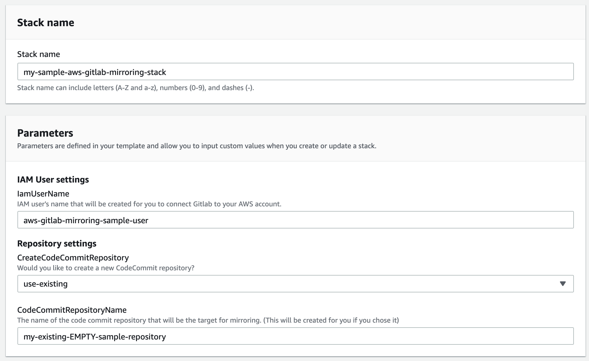
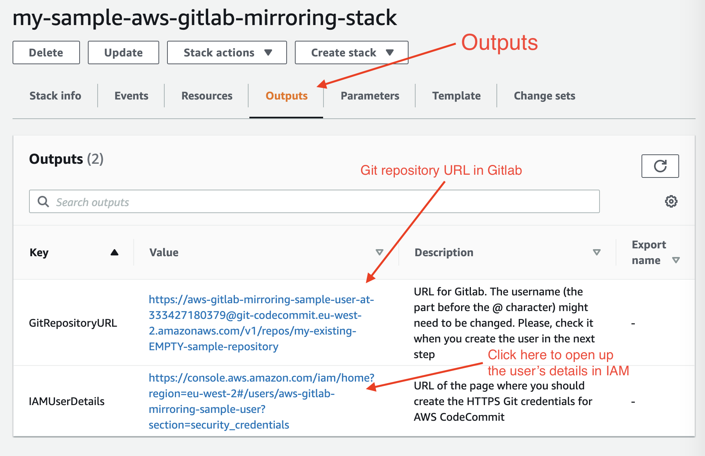
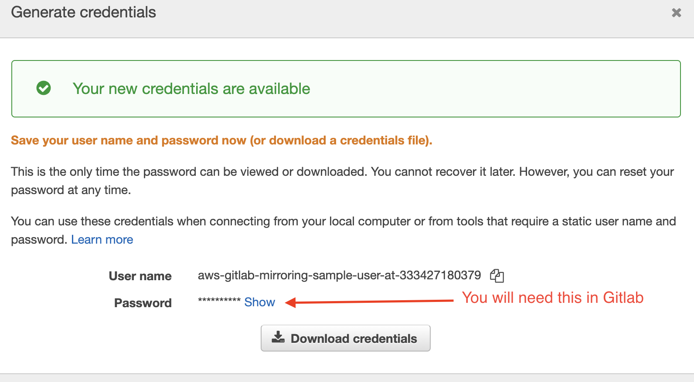
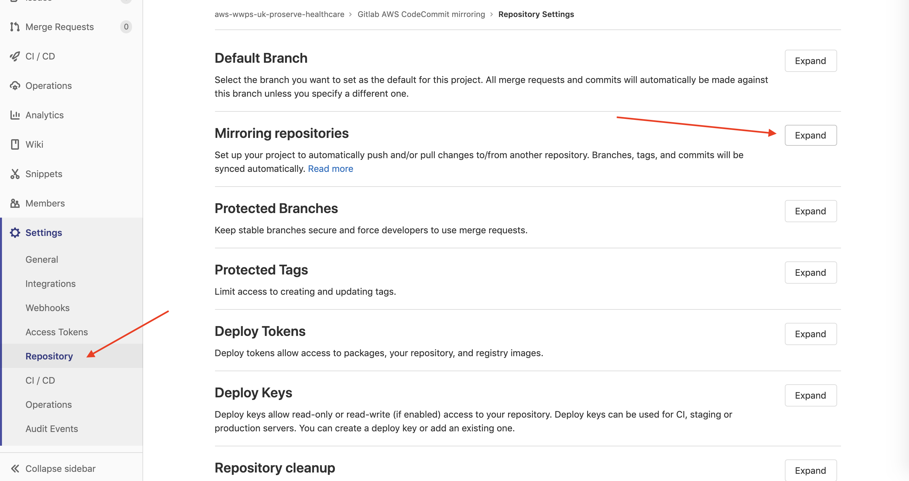
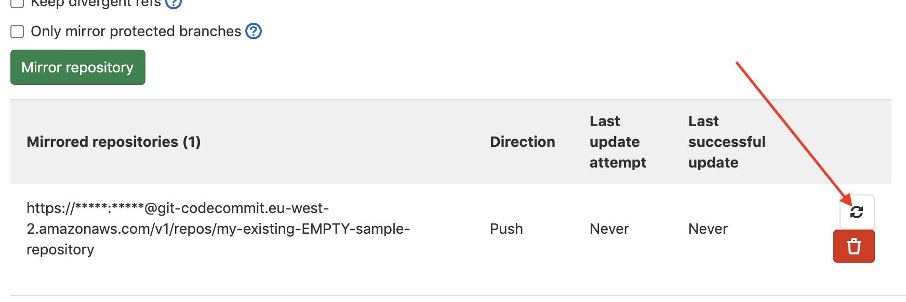

# Internal AWS Gitlab/AWS Codecommit mirroring

This tutorial and the CloudFormation stack is intended to help AWS employees to set up mirroring between our [internal Gitlab](https://gitlab.aws.dev/) and AWS CodeCommit on their AWS account.

The problem with Gitlab is that most of the CI/CD pipelines we have are built on top of AWS CodeCommit.

This small solution can help you to leverge your existing CI/CD pipeline in your AWS account and the same time use Gitlab as your main source code repository. You can choose to mirror your repository to an **existing empty** AWS CodeCommit repository or you can **create a new** one automatically.

### Benefits of this solution

* Since all the resources are created using CloudFormation, it's easy to remove it. _(Note: by default it will also delete the AWS CodeCommit repository upon deletion if it was created by the stack)_
* The user has minimal privilige. It's only allowed to push and pull from the target repository. Nothing more.
* The user will not have any AWS Access keys. _(you can also import the IAM user to Isengard)_

## Setup (~ 5 minutes)

1. Login to AWS console in the account where you want to mirror your Gitlab repository.
2. Go to CloudFormation. **Make sure you are in the same region as the AWS CodeCommit repository**
3. Download [./template.yaml](./template.yaml)

Then create a new CloudFormation stack using the downloaded file.

    1. Choose an IAM user name that will be created for you with minimal priviliges
    2. Select if you want to create a new AWS CodeCommit repository.
    3. Type in the name of the existing or new _(based on previous step)_ repository that will be used for mirroring. **If you use an existing repository, the repository itself must be empty**
4. Once the stack is created, navigate to the CloudFormation stack `Outputs`

5. Open the link in a new window next to `IAMUserDetails` (this will open up the IAM user's details, security credentials tab)
Right tab:

Right section:

Generate Credentials:

6. Click on `HTTPS Git credentials for AWS CodeCommit -> Generate credentials` for the IAM user and leave the modal open. You will need the password later 
7. In a new window, open up your [Gitlab](https://gitlab.aws.dev/) repository and navigate to `Settings -> Repository`

8. In Gitlab, expand the `Mirroring repositories` section and fill it out the following way:

    1. Git repository URL should be the `GitRepositoryURL` from the outputs of your CloudFormation file
    2. Mirror direction: `Push`
    3. Authentication method: `Password`
    4. Password: Insert the password in from step 6. _(If you need to regenerate the password, you will need to remove the old one first OR change the username, aka the text before the @ characheter, in the Git repository URL according the new username)_
9. Once added, click on the Refresh/Update now button next to the name of the repository.

## Feedback

**If you like this solution, please, click on the star.**

If you have any issues or you found a bug, you can create a new Issue in Gitlab.

If you want to submit improvements, feel free to send in a Merge Request.

If you want to provide constructive feedback, you can message the new owner of this, Viji on [Slack](https://slack.com/app_redirect?channel=@vijrvic). _[(Check out this first)](https://www.nohello.com/)_
