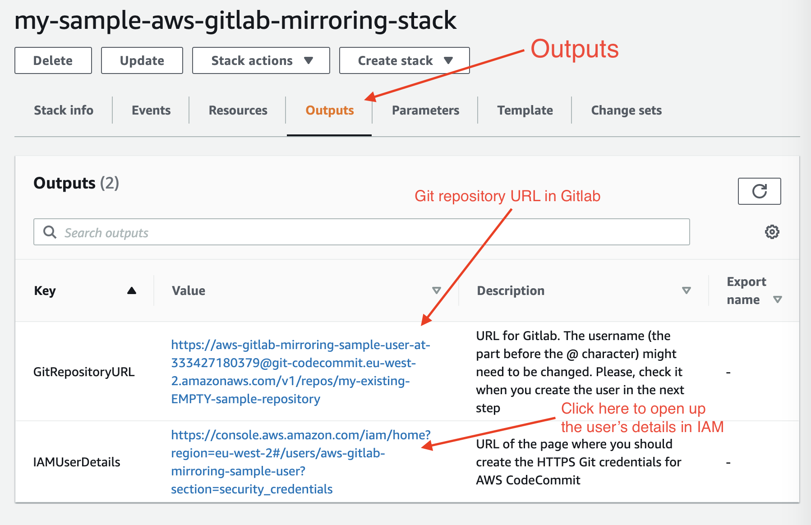
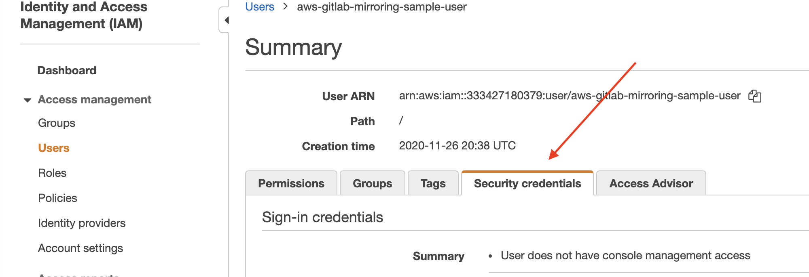
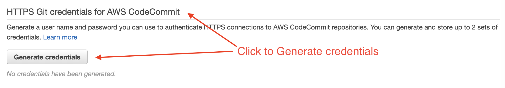
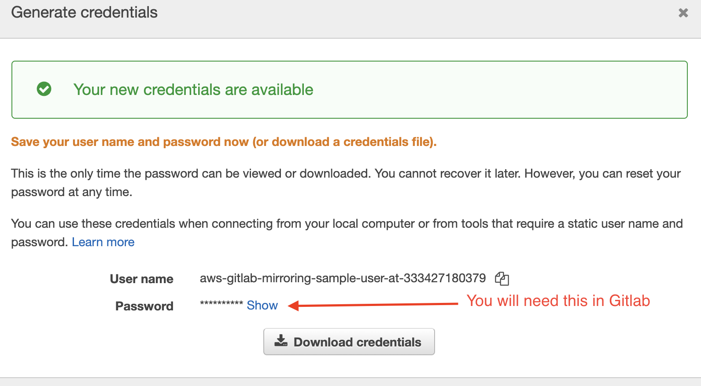
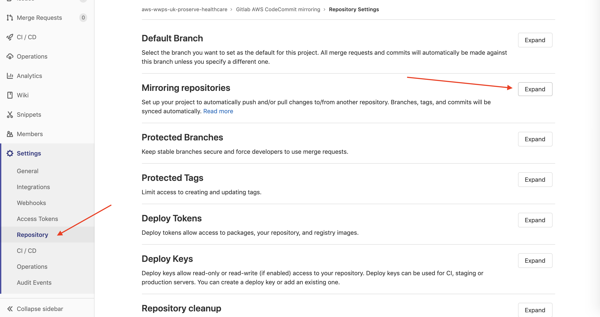
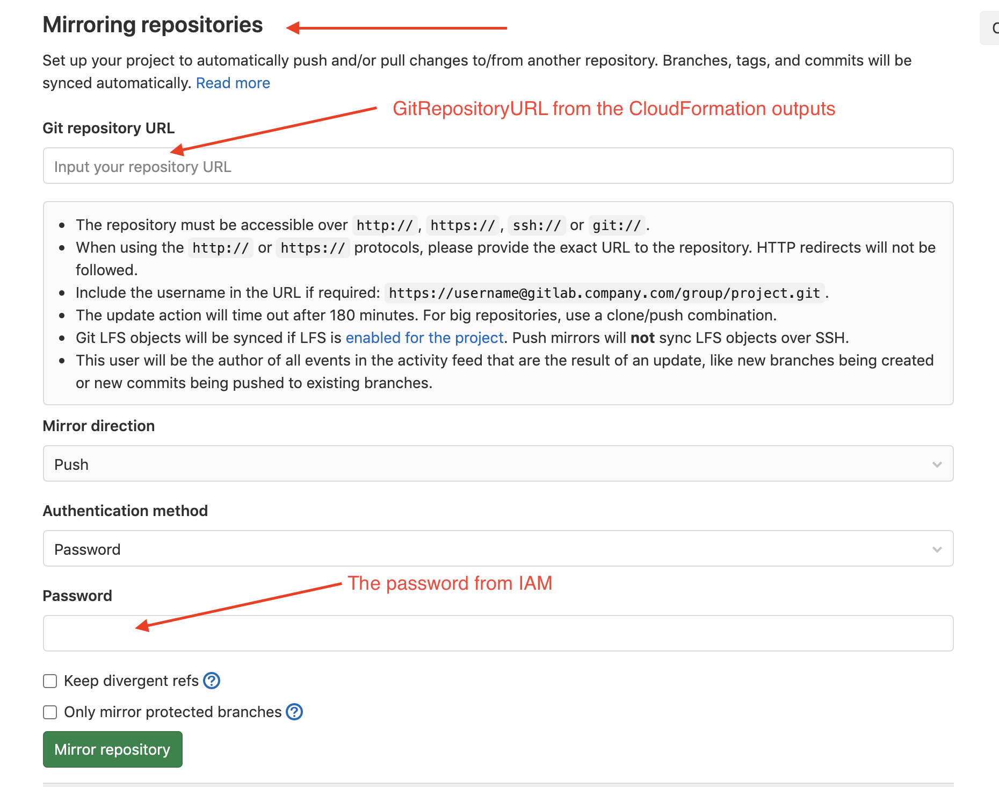
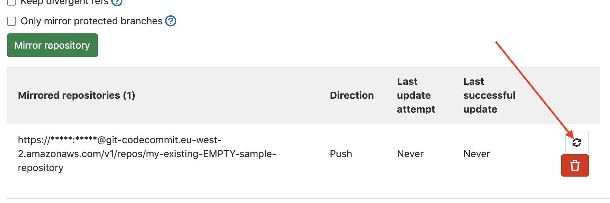

# Internal AWS Gitlab/AWS Codecommit mirroring

This CFN stack wrapped in CDK deploys the necessary resources to mirror a gitlab repo to AWS Codecommit. It deploys an IAM user called `aws-gitlab-mirroring`. The CDK wrapper accepts an existing codecommit repository name as a prop and passes it as a Cloudformation stack parameter to give codecommit push permissions to the defined IAM user. It returns the repository mirroring url and the IAM username and link as outputs.

## Setup (~ 5 minutes)

1. Deploy the CDK stacks using the implementation guide
2. Once the stacks are created, navigate to the CloudFormation stack `Outputs`

3. Open the link in a new window next to `IAMUserDetails` (this will open up the IAM user's details, security credentials tab)
Right tab:

Right section:

Generate Credentials:

4. Click on `HTTPS Git credentials for AWS CodeCommit -> Generate credentials` for the IAM user and leave the modal open. You will need the password later 
5. In a new window, open up your [Gitlab](https://gitlab.aws.dev/) repository and navigate to `Settings -> Repository`

6. In Gitlab, expand the `Mirroring repositories` section and fill it out the following way:

    1. Git repository URL should be the `GitRepositoryURL` from the outputs of your CloudFormation file
    2. Mirror direction: `Push`
    3. Authentication method: `Password`
    4. Password: Insert the password in from step 6. _(If you need to regenerate the password, you will need to remove the old one first OR change the username, aka the text before the @ characheter, in the Git repository URL according the new username)_
7. Once added, click on the Refresh/Update now button next to the name of the repository.
