# Quicksight Module Setup

## Quicksight Setup: Console

1. Log into AWS Console and navigate to *Amazon QuickSight*

   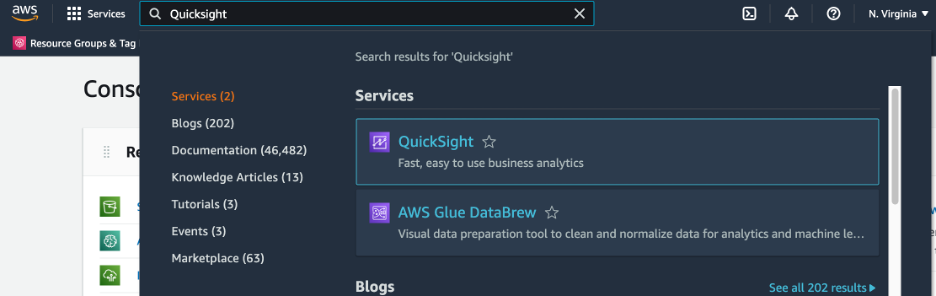

1. If you haven’t used QuickSight before, click on *Sign up for QuickSight*, otherwise skip this step and proceed to *Set Up a QuickSight User*

   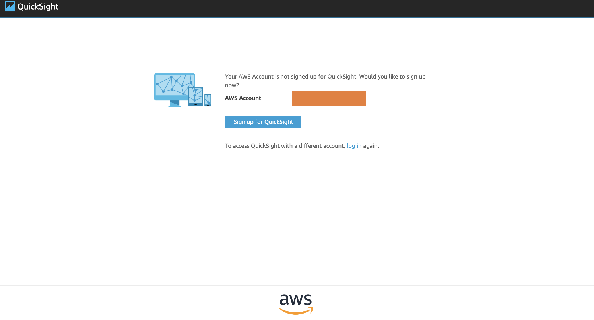

2. Select the *Enterprise* edition, and click *Continue*

   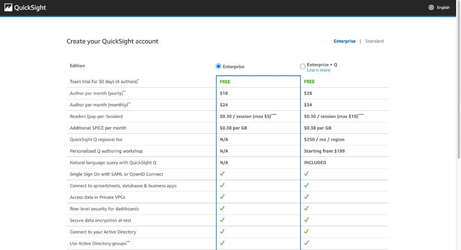

3. Under *Create your QuickSight account*, ** fill in the following:
    1. Authentication method: Use IAM federated identities & QuickSight users
    2. QuickSight region: Select the region used for your deployment
    3. QuickSight account name: Account name must be globally unique (i.e. “carbon-data-lake-{account-number}”)
    4. Notification email address: Enter your email address

    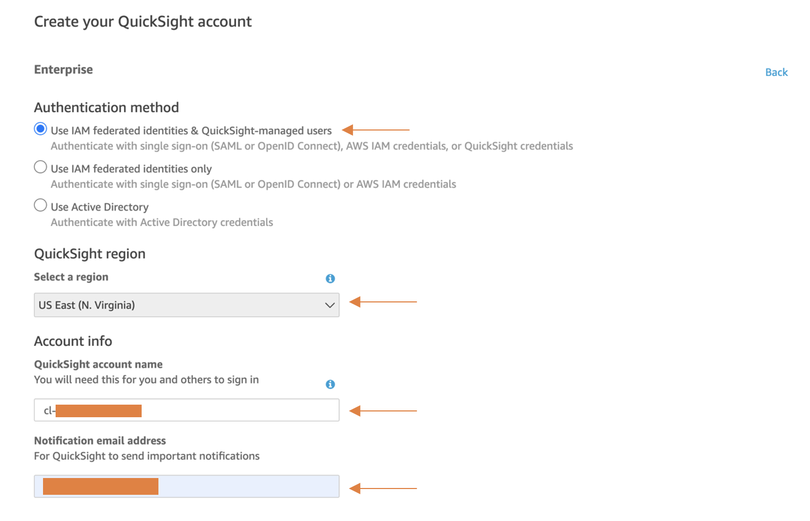

4. Under *QuickSight access to AWS services*, fill in the following:
    1. IAM Role: *Use QuickSight-managed role (default)*
    2. Check *Amazon Athena*

   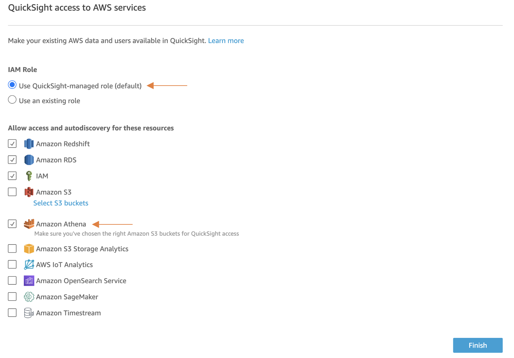

5. Click *Finish* to complete your account setup

## *Set up Amazon QuickSight user*

1. Click your username in the upper right corner to expand admin options and select *Manage QuickSight*

    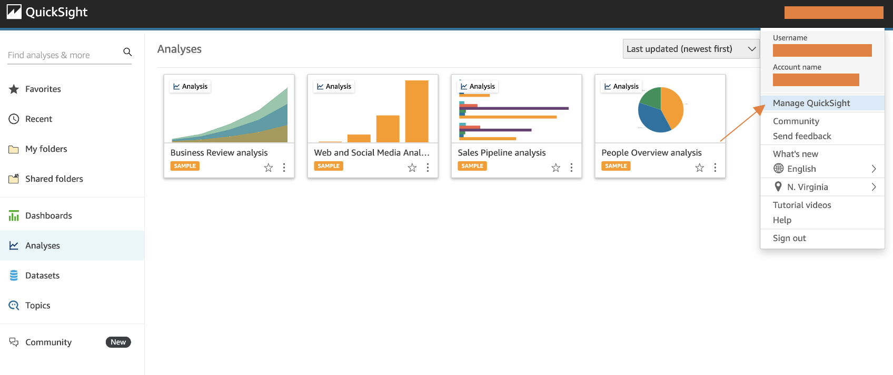

2. Select *Invite Users*

   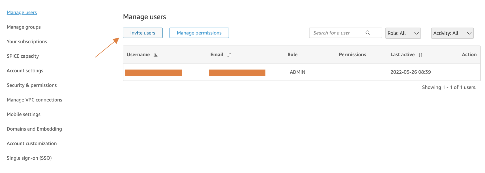

3. Enter your desired username into the input field and click *+*. Note: for simplicity, we recommend using your email address as your username. However, QuickSight usernames only allow lowercase letters, uppercase letters, numbers, ‘_’, ‘-’ or ‘.’. If your email address does not fit those requirements, specify a different username.

   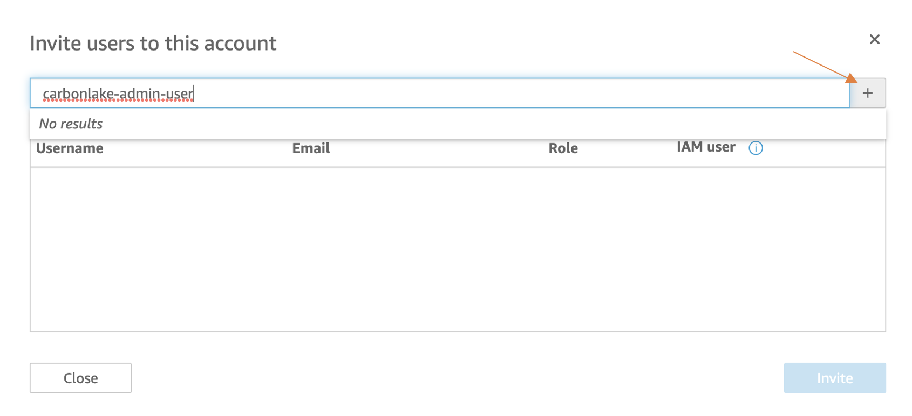

4. Fill in your email address, select *AUTHOR* as the desired role for your user and click *Invite* to send an invitation.

   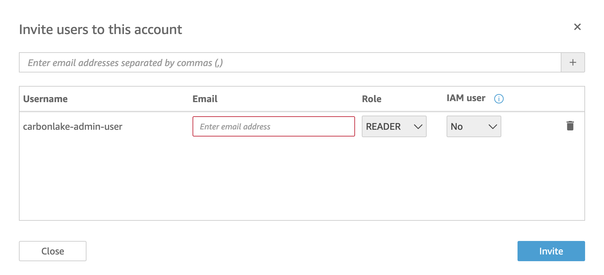

   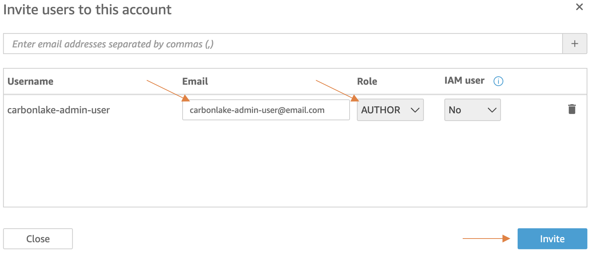

5. You should receive an email from Amazon QuickSight. If you do not, click *Resend invitation* in the Quicksight console.
6. From your email, click *Click to accept invitation* to confirm your QuickSight user. This is the user you will log into the QuickSight console with to view the emissions dataset and dashboard.

   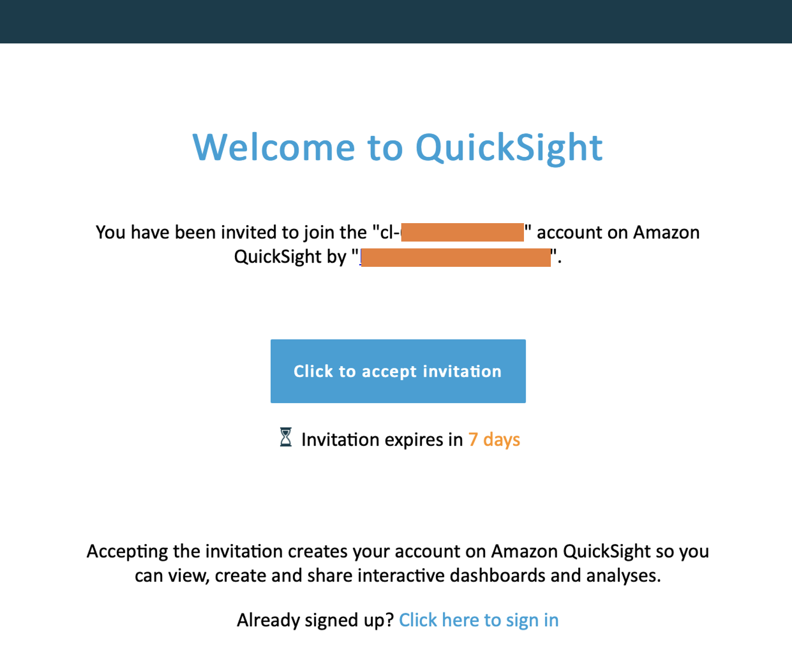

7. Now you need to go to `cdk.context.json` and enter the `quicksightUsername` you just entered as the parameter for `quicksightUsername`

   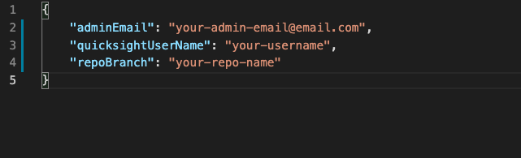

8. You can now `cdk deploy --all` or `cdk deploy QuicksightStack`
9. Log in to the quicksight console with your newly created username. You will need to use the `ACCOUNT_NAME` that you chose when you created the account and sign in with your password.
10. You should now be able to select "dashboard" on the left menu and select the Combined-Emissions-Dashboard. Note that this data will be updated only once you drop data into your carbon-data-lake landing zone bucket and after the nightly data compaction job. You can also trigger the compaction job by navigating to the Step Functions Workflow AWS Console and selecting "run" on the data compaction step function after you have uploaded data.
