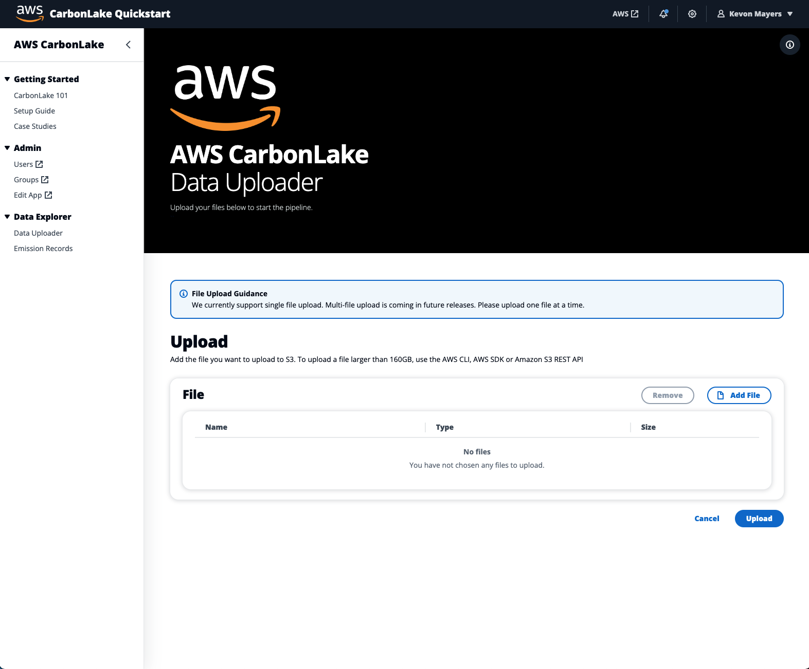

# CarbonLake Web Application Documentation

## 👋 Introduction

This sample app is used to serve as a demonstration for what you can do with the CarbonLake Quickstart core features. This code is meant to be used purely for development/demo purpose. For production workloads it is ***highly*** recommended that you do your own extensive internal testing and modification before using.

This package sets up a React development environment that has access to all [Cloudscape](https://cloudscape.design/) React components. It comes with a sample application using the AWS-UI to give a demo of what your own Amplify Application using CarbonLake could look like. See [Getting started with Cloudscape](https://cloudscape.design/get-started/guides/introduction/).

## 🏁 Getting started

### 🎒 Prerequisites

* The CarbonLake CDK Application must be deployed and running in an active AWS account
* This application requires that you have accurate outputs from `cdk-outputs.json` -- check that this file has been successfully created upon deployment of your application.
* [Node.js installed](http://nodejs.org): if you don't already have it, run `brew install node` to download Node (Homebrew needs to be installed for this to work) - Run `node -v ` to check your version.
* [NPM installed](https://www.npmjs.com/) - Run `npm -v` to check your version.
* [IAM User or Role](https://docs.aws.amazon.com/IAM/latest/UserGuide/id_roles_create.html) with necessary permissions created (role is recommended)
* [AWS Amplify CLI installed](https://docs.amplify.aws/cli/)
* Run `npm install -g @aws-amplify/cli`
* Run  `amplify --version` to verify installed version

## 🔐 Security Notice

It is important to note that **4 IAM roles** are created by CDK. These roles in addition to the Cognito User Pool Groups determine what permissions your users can perform. You can add additional roles, user pool groups, and users to the groups either via the AWS Management Console, or with CDK (another IaC provider). During testing/development it is fine to launch resources in the console, however for production workloads it is ***HIGHLY*** recommended to manage your resources via IaC (Infrastructure as Code).

### IAM Roles

* clqsAdminUserRole
* clqsStandardUserRole
* clqsAuthRole
* clqsUnAuthRole

### Cognito User Pool Groups

* Admin
* Standard-Users

When users are added to the above groups, they have the respective permissions granted through the IAM roles (**clqsAdminUserRole** or **clqsStandardUserRole**). The standard permissions are all S3 actions for all resources. For the clqsAuthRole and clqsUnAuthRole, the permissions are S3 read-only. To modify these permissions, edit the customer managed policies in **/lib/api/carbonlake-api-stack.ts**"
***HINT***: in some resources launched by CDK will start with **clqs** - this stands for **CarbonLakeQuickstart**. When searching for resources deployed by CDK for the quickstart, resources should begin with **clqs** or include **CarbonlakeQuickstart** in the resource name.
EX: clqsAdminUserRoleB570F25-PONQFPYKOOBAB

## Recommended: 🚀 Quick Setup Guide

For the simplest setup you will need to have access to a linux or unix shell. If you are running MacOS or Linux you don't need to do anything else. If you are working with Windows you will need to install a linux shell emulator such as WSL. If you are using windows either skip to the manual installation or make sure you have a way to execute shell script commands. You will also need to install jq with `brew install jq` `apt-get install jq` or another suitable method for package installation. For more on installing jq for your operating system visit the [jq docs](https://stedolan.github.io/jq/download/).

### Instructions

```sh
cd front-end/carbonlake-ui-cloudscape
sh ampdeploy/scripts/deploy-amplify-script.sh # please note that if you are running Windows you will need to wrap this command in your standard windows shell wrapper
```

## Advanced: 🚀 Manual Setup Guide

### 1/ Check that CarbonLake Quickstart CDK has deployed

Ensure that the CDK for the quickstart has been deployed following all instructions contained in the CarbonLake Quickstart Deployment guide.

### 2/ Install dependencies

```sh
cd front-end/carbonlake-ui-cloudscape # navigate to the amplify app directory
npm install # install amplify app dependencies
```

### 3/ Initialize web application

```sh
amplify init # this initializes the amplify app and will prompt you for several inputs
```

**(ENSURE YOU ARE IN THE ROOT of the app directory `front-end/carbonlake-ui-cloudscape` and not in any sub directory

### 4/ Follow amplify setup prompts

```sh
? Do you want to use an existing environment? (Y/n) #choose n for no
? Enter a name for the environment #choose dev or something different
? Choose your default editor #choose editor you are using
? Select the authentication method you want to use # AWS profile is recommended
```

When it successfully deploys you should see a prompt like the one below 👇

```javascript
CREATE_COMPLETE amplify-carbonlaketestapp-dev-215347 AWS::CloudFormation::Stack Thu May 26 2022 21:54:20 GMT-0400 (Eastern Daylight Time)
✔ Successfully created initial AWS cloud resources for deployments.
✔ Initialized provider successfully.
✅ Initialized your environment successfully.

Your project has been successfully initialized and connected to the cloud!

[redacted]
```
When deploying the CarbonLake QuickStart CDK, a Cognito user pool `CarbonLakeQuickStartUserPool`, Identity pool `CarbonLakeQuickStartIdentityPool`, and GraphQL API `CarbonLakeApi` will be deployed automatically, so **do not**  run the command `amplify add api` or `amplify add auth`. These resources will be imported from `cdk-outputs.json`

### 6/ Generate the Appsync GraphQL Helper Code

```javascript
amplify add codegen --apiId <get api id from cdk-outputs.json file>
```

You should receive a success message and be prompted to choose the code generation language target. You may also optionally enter the file name pattern for queries, mutations and subscriptions (default will be `src/grapql/**/*.js*`. When prompted choose **'Y'** to generate/update all possible GraphQL operations. For maximum statement depth, choose the number that suits the complexity of your statement. For our testing we used **'2'**.

### 7/ Start your AWS Amplify application running on localhost

```sh
npm start
```

You should see a cognito login page with input fields for an email address and password. Enter your email address and the temporary password sent to your email when you created your CarbonLake Quickstart CDK Application. After changing your password, you should be able to sign-in successfully at this point. 

***NOTE: The sign-up functionality is disabled intentionally to help secure your application. You may change this and add the UI elements back, or manually add the necessary users in the cognito console while following the principle of least privilege (recommended).***

Success! At this point, you should successfully have the Amplify app working.

### 8/ Add Amplify Hosting & Publish

```sh
amplify add hosting
amplify publish
```

## 🥳 Usage

### 1/ Test out the application by uploading some data

Navigate to the `Data Uploader` page. Browse for a file and click `Upload` (you must be signed in as a user in the Admin group to do this. If not, you will receive an error message).



### 2/ Check that your data is flowing properly to the dashboard

Navigate to the dashboard and check that the table is flowing to your table.

### 3/ Optional: Add appsync helper code using codegen

For advanced implementation only. Use this method if you want to modify AppSync GraphQL API helper code. Start by removing the current codegen helper functions.

```sh
amplify remove codegen
```

Appsync helper code is used to help connect your frontend with the CarbonLake GraphQL API backend. Use amplify codegen and your graphQL api ID to generate the helper code. You can do this by navigating to the AWS Console and selecting AppSync and copying the relevant command, or using she prompt below. This will take the `apiId` from the `ApiStack` and generate it for you.

```sh
amplify add codegen --apiId abcedfghjk1234567
# you will see the response below
✔ Getting API details
Successfully added API clqsApi to your Amplify project
? Choose the code generation language target
# we recommend typescript, as this application is primarily written in typescript
? Enter the file name pattern of graphql queries, mutations and subscriptions
# default is (src/graphql/**/*.ts) and we recommend you use this
? Do you want to generate/update all possible GraphQL operations - queries, mutations and subscriptions
# choose Y for yes
? Enter maximum statement depth [increase from default if your schema is deeply nested]
# we recommend 2, and we tested with 2
? Enter the file name for the generated code (src/API.ts)
# press enter to keep default
? Do you want to generate code for your newly created GraphQL API (Y/n)
# enter Y for yes
```

## 📚 Helpful Resources

### NPM Commands

* `npm install` - downloads app dependencies
* `npm start` — watches the project with continuous rebuild. This will also launch HTTP server with [pushState](https://developer.mozilla.org/en-US/docs/Web/Guide/API/DOM/Manipulating_the_browser_history).
* `npm run build` — builds a minified project for production

### Helpful commands (AWS Amplify)

* `amplify init` - initialized a new Amplify project. Must run this from the root directory of the frontend app.
* `amplify pull` -  operates similar to a git pull, fetching upstream backend environment definition changes from the cloud* and update the local environment to match that definition
* `amplify console` - launches the browser directing you to your cloud project in the AWS Amplify Console. *Only necessary when using the Amplify CLI to launch resource (beyond the scope of this quickstart).*

### Learn

* source files are fully auto-generated and served by HTTP server.  Write your code in `src/` dir.
* Place static files in `public/`
* [Configuring Vite](https://vitejs.dev/config/).
